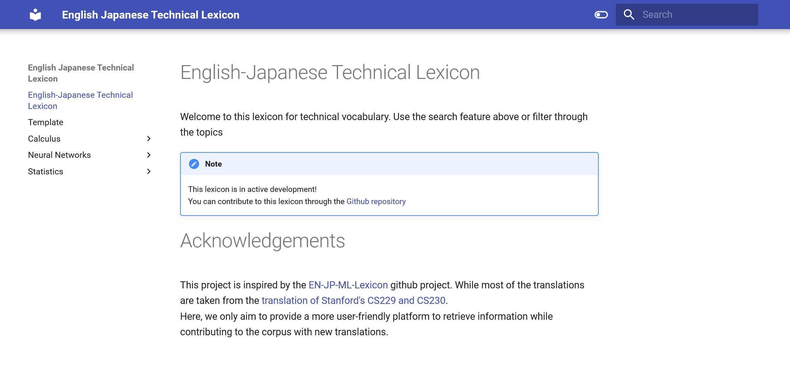

# ENJP Technical Lexicon

This repository gives a mkdocs baseline for the English-Japanese Technical Lexicon available [here](https://basilems.github.io/ENJP-Technical-Lexicon/)


## Quick start

When accessing the website, you will find entries either by searching the top search bar or by filtering through the topics on the left side.



## Installation

When cloning the project, there are some install requirements:
```
pip install mkdocs
pip install mkdocs-materials
pip install mkdocs-roamlinks-plugin
pip install mkdocs-mermaid2-plugin
pip install mkdocs-callouts
```

## Contribute

If you want to contribute to this repository, you can duplicate the [Template.md](Template.md) in the root directory of the project. This preserves the same layout for all entries in the lexicon for a better experience.