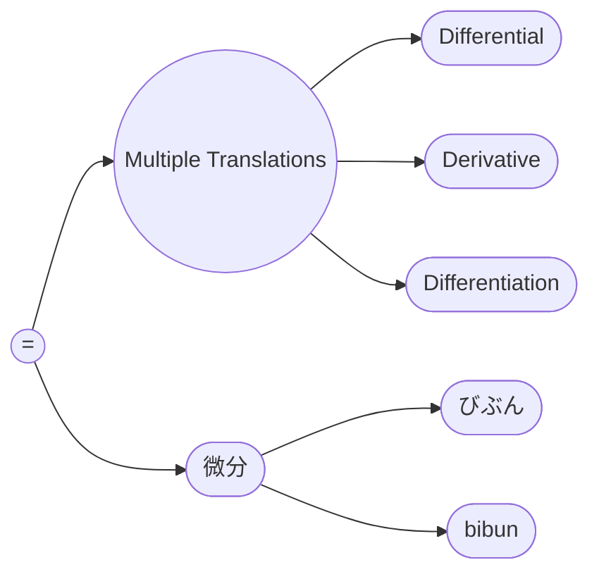

---
tags:
  - Mathematics
  - Calculus
---

# Differential - 微分

```mermaid
graph LR
  A((=)) --> B((Multiple Translations));
  B --> F([Differential]);
  B --> G([Derivative]);
  B --> H([Differentiation]);
  A --> C([微分]);
  C --> D([びぶん]);
  C --> E([bibun]);

```

>[!CAUTION]
>May be confused with:
>- [[Distribution - 分布]]

