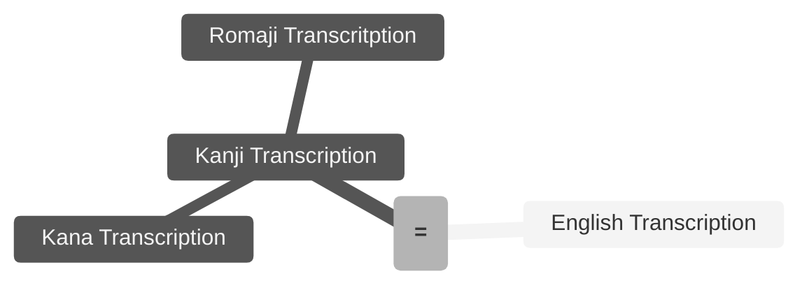

# [Create file with name: "\<English> - \<Japanese>"]

```mermaid
%%{init: {'theme':'neutral'}}%%
mindmap
(**=**)
	English Transcription
	Kanji Transcription
		Kana Transcription
		Romaji Transcritption
```

> [!CAUTION]
> May be confused with
>  - Name 1
>  - Name 2

___

[Include the appropriate tags under this line]