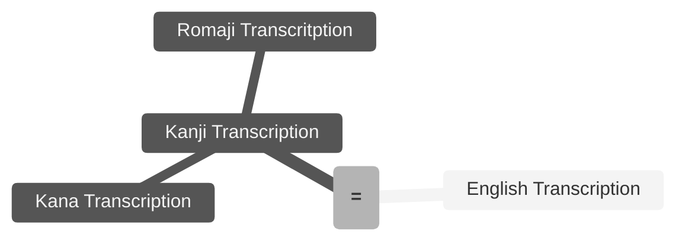

``` Delete the code segment before commit
---
tags:
  - tag 1
  - tag 2
---
```
# [Create file with title and name: [English] - [Japanese]]


> [!CAUTION]
> May be confused with
>  - Name 1
>  - Name 2